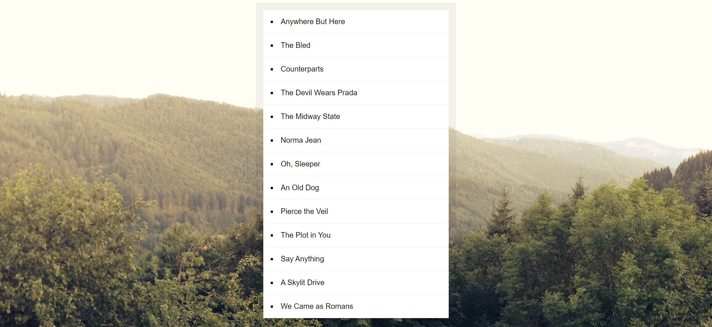

**Day 17: Sorting Bands with JavaScript**

On Day 17 of our 30 Days JavaScript Challenge, I delved into the world of sorting and manipulating arrays. Here's a brief insight into what I learned:

📊 **Sorting Arrays with Style**: Our mission was to take an array of band names and sort them in a unique way. Instead of simply alphabetizing, we wanted to remove common prefixes like "The," "A," and "An" before sorting.

✂️ **String Manipulation**: To accomplish this, we harnessed the power of regular expressions (`bandName.replace()`) to remove these prefixes. The `strip` function elegantly trimmed away these common words, ensuring that the sorting process would be based on the significant part of the band names.

🔀 **Custom Sorting Logic**: The `sortedBands` array was sorted using a custom comparison function within the `bands.sort()` method. This function compared the stripped band names and determined their order.

🎵 **Displaying the Sorted List**: Finally, we displayed the sorted list of bands on the web page. By using `document.querySelector()` and the HTML `innerHTML` property, we dynamically updated the content to showcase the sorted band names.

By mastering this technique, we gained the ability to sort and manipulate arrays with customized logic, making our web applications more user-friendly and intuitive. As our 30-day JavaScript journey unfolds, we'll continue to explore exciting JavaScript concepts and practical applications. Stay tuned for more enlightening discoveries! 🚀🎸

# Output Image 

